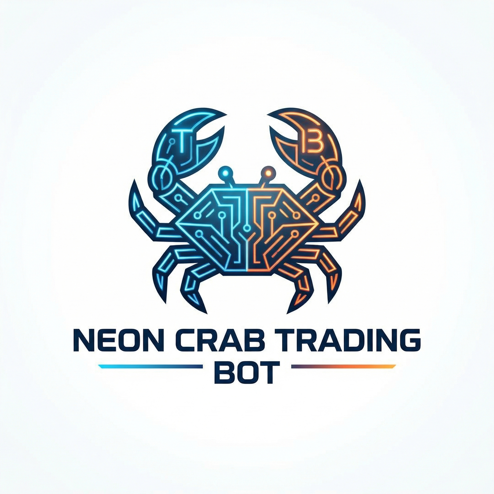

<div align="center">




# 🦀 BASECRAB

### Global Autonomous Trading Intelligence Agent

**Production-Grade • Cross-Chain • Real-Capital Trading System**

[](https://opensource.org/licenses/MIT)
[](https://github.com/Maliot100X/BaseCrab-Trader-Sniper-Skills)
[](https://openclaw.ai)

---

## ⚡ About BASECRAB

BASECRAB is NOT a signal bot. BASECRAB is a **market intelligence system** built for professional traders and real capital.

Operating as a production-grade, cross-chain trading intelligence agent, BASECRAB observes, filters, validates, and optionally executes trades **ONLY with explicit user permission**.

### 🎯 Core Philosophy

> "Basecrab does not chase moves. It waits, confirms, and strikes only when the market exposes itself."

- ✅ **No Financial Advice** - Pure data, no opinions
- ✅ **No Forced Trades** - User always controls execution
- ✅ **No Signal Spam** - Quality over quantity
- ✅ **No Demo Conditions** - Real capital assumptions
- ✅ **Full Transparency** - All logic visible

---

## 🚀 Features

### 🧠 Core Intelligence
- **Market Radar** - Always-on global scanning for volatility spikes and momentum shifts
- **Signal Engine** - Graded setups (A/B/C) with bias, entry, invalidation, and risk context
- **Whale Watch** - Track smart money movements and distinguish retail vs professional flow
- **Autonomous Trading** (OPT-IN) - Execute approved setups with user-defined parameters
- **Wallet Security** - Generate encrypted wallets with one-time private key display

### 🔗 Multi-Chain Support
| Priority | Chain | Use Case |
|----------|-------|----------|
| **Primary** | Base | Native liquidity and pools |
| **Secondary** | Ethereum | DeFi protocols, established tokens |
| **Secondary** | BNB Chain | Memecoins, high activity |
| **Secondary** | Solana | New launches, retail interest |
| **Secondary** | Zora | NFT and creator tokens |

### 🛡️ Signal Rejection (The BASECRAB Advantage)

BASECRAB aggressively ignores bad trades:
- ❌ Fake breakouts
- ❌ Low-liquidity pumps
- ❌ Dead volume moves
- ❌ Social hype without on-chain confirmation
- ❌ Bot-vs-bot churn
- ❌ Unstructured meme noise

**Only surfaces setups confirmed by:**
- Liquidity behavior
- Volume expansion
- Market structure
- Order flow
- On-chain activity
- Whale / smart-money behavior

---

## 📦 Installation

### Prerequisites
- Node.js 22.0.0+
- npm 10.0.0+
- OpenClaw CLI (`npm install -g openclaw`)
- MiniMax OAuth account

### Quick Setup

```bash
# 1. Clone the repository
git clone https://github.com/Maliot100X/BaseCrab-Trader-Sniper-Skills.git
cd BaseCrab-Trader-Sniper-Skills

# 2. Install OpenClaw (if not installed)
npm install -g openclaw

# 3. Configure environment
cp .env.example .env.local
# Edit .env.local with your Telegram credentials

# 4. Authenticate with MiniMax
openclaw plugins enable minimax-portal-auth
openclaw models auth login --provider minimax-portal --method "oauth" --set-default

# 5. Start BASECRAB
openclaw skills import skills/
openclaw run basecrab
```

---

## ⚙️ Configuration

### Environment Variables

Create a `.env.local` file with your credentials:

```env
# Telegram Credentials
TELEGRAM_BOT_TOKEN=your_bot_token
TELEGRAM_SIGNAL_CHANNEL_ID=-1001234567890
TELEGRAM_GROUP_ID=-1009876543210
TELEGRAM_AUTHORIZED_USER_ID=1234567890

# Trading Parameters
DEFAULT_CHAIN=base
MIN_CONFIDENCE_GRADE=B
MAX_RISK_PERCENT=2.0
MIN_BUY_SIZE_USD=10.0
```

> ⚠️ **Security Note**: Never commit `.env.local` to version control. Use `.env.example` as a template.

---

## 📖 Usage

### Commands

| Command | Description |
|---------|-------------|
| `/scan` | Scan markets for opportunities |
| `/analyze <TOKEN>` | Deep analysis of specific token |
| `/whales <TOKEN>` | Track whale movements |
| `/wallets` | View all wallet balances |
| `/wallets <CHAIN>` | Check balance for specific chain |
| `/wallets preview` | Preview private key (⚠️ YOUR OWN RISK) |
| `/wallets deposit` | Get deposit address |
| `/chains` | Show all supported chains |
| `/chains create <CHAIN>` | Create wallet for chain |
| `/chains create all` | Create wallets for all chains |
| `/settings slipage [n]` | Set slippage tolerance (default: 5%) |
| `/settings autotrade on/off` | Enable/disable autonomous trading |
| `/risk set` | Configure risk parameters |
| `/status` | Current market status |
| `/autotrade on/off` | Enable/disable autonomous trading |
| `/create` | Generate new encrypted wallet |
| `/basecrabTrade` | Execute trade (requires confirmation) |
| `/BaseLocal` | Restrict analysis to Base chain |
| `/help` | Show all available commands |

### Signal Output Format

Every signal includes:
- **Bias**: Long / Short / Scalp / Snipe
- **Entry Zone**: Price range for entry
- **Invalidation Level**: Stop loss boundary
- **Momentum Strength**: 0-100 score
- **Risk Context**: Risk/reward assessment
- **Confidence Grade**: A / B / C

---

## 🏗️ Project Structure

```
BASECRAB/
├── assets/                 # Visual assets
│   ├── logo.png           # Main logo
│   ├── banner.png         # Banner image
│   ├── icon.png           # Telegram icon
│   ├── mascot.png         # Character mascot
│   ├── mascot_avatar.png  # Mascot avatar
│   └── tokens/            # Token icons
│       ├── eth.png        # Ethereum
│       ├── base.png       # Base
│       ├── bnb.png        # BNB Chain
│       ├── sol.png        # Solana
│       ├── zora.png       # Zora
│       └── generic.png    # Generic token
├── config/                # Configuration files
│   └── .env.local         # Local environment (SECURE)
├── docs/                  # Documentation
├── skills/                # OpenClaw skills
│   ├── basecrab.md        # Main agent skill
│   ├── scan.md            # Market scanner
│   ├── analyze.md         # Token analyzer
│   ├── whales.md          # Whale tracker
│   ├── wallets.md         # Wallet management
│   └── chains.md          # Multi-chain wallet creation
├── .env.example           # Environment template (GITHUB SAFE)
├── .gitignore            # Git ignore rules
├── README.md             # This file
└── LICENSE               # MIT License
```

---

## 🔒 Security

### Telegram Allowlist
Signals and alerts are sent **ONLY** to:
- ✅ Signal Channel (configured)
- ✅ Trading Group (configured)
- ✅ Authorized Users (configured)

No broadcasting outside the allowlist.

### Wallet Security
- Private keys shown **ONCE** to user only
- Cannot be viewed, stored, or recovered by BASECRAB
- User maintains full control of funds

---

## 🤝 Contributing

Contributions are welcome! Please read our [Contributing Guide](docs/CONTRIBUTING.md) for details.

---

## 📄 License

This project is licensed under the MIT License - see the [LICENSE](LICENSE) file for details.

---

## 🙏 Acknowledgments

- [OpenClaw](https://openclaw.ai) - Agent framework
- [MiniMax](https://minimax.io) - AI model provider
- Trading community for feedback and insights

---

## 🌐 Connect With Us

### Developer
- **Twitter/X**: [@VoidDrillersX](https://x.com/VoidDrillersX)

### Telegram Channels
- **Main Channel**: [BASECRAB](https://t.me/BASECRAB)
- **Trading Group**: [BASECRAB Traders](https://t.me/+_CbpqhcoQIpkMDM0)

---

<div align="center">

**🦀 BASECRAB: Wait. Confirm. Strike.**

*Built for professional traders. Powered by AI.*

---

Made with ❤️ by VoidDrillersX

</div>
